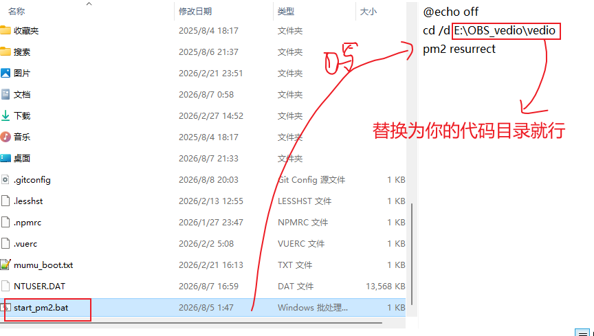

# local_veido_player
本地视频播放服务-python，http，range

# 首页效果


# 具有下面功能
1. 仿照blibli的设计，大体功能都有（播放，暂停，视频翻转，。。）
2. 多线程流程播放


使用方式
一 运行项目
1. 直接运行  python app-v2.py
2. 使用pm2运行项目


根据输出选择网址访问就行（仅限局域网（同一个wifi下））

```agsl
==============================================================
  AryPlayer 高性能视频流服务器已启动
==============================================================
  📁 服务目录: E:\OBS_vedio\vedio
  🌐 本地访问: http://localhost:9000
  📱 手机访问: http://192.168.0.101:9000
  ✨ 内置美观播放器 · 分类浏览 · 连续播放
  ⚙️  Range请求 | 多线程 | 64KB缓冲区优化
  🎯 支持格式: MP4/MKV/AVI/MOV/MP3/FLAC 等
==============================================================
  提示: 点击视频/音频文件即可进入美观播放器页面
  快捷键: 空格(播放/暂停) ←→(±5s) ↑↓(音量)
  按 Ctrl+C 停止服务器
==============================================================
```


#### 补充：后台常驻运行（关闭黑窗口后 继续运行） && 开机自启动运行

1. 启动项目
```agsl
pm2 start ecosystem.config.js
# 001 启动
pm2 sava
# 保存当前运行的进程列表（会自动生成 dump.pm2）
```
2. 开机自启&&崩溃自启

（设置开机批处理脚本）
（然后设置这个脚本为自启动）
```agsl
方式 2：任务计划程序【最推荐✨，支持开机不登录、管理员权限、延迟启动】
适合：需要管理员权限、开机后台跑、不想弹窗黑框、登录前就启动。
Win 搜索：任务计划程序打开
右侧 → 创建基本任务
名称：MyAutoBat
触发器：当计算机启动时（开机就跑，不用登录） / 选择当我登录时（登录才跑）
操作：启动程序
程序或脚本：浏览选中你的 xxx.bat
起始于 (可选)⚠️非常重要！填写 bat 所在文件夹，不带文件名
例：bat 在D:\code\tools\run.bat
程序：D:\code\tools\run.bat
起始于：D:\code\tools
如果不填起始于，bat 里面相对路径全部失效！
设置：
✅勾选「不管用户是否登录都要运行」（后台无弹窗）
✅勾选「不存储密码」
✅勾选「最高权限运行」（如果 bat 需要管理员）
调试：选中任务 → 右侧「运行」直接测试是否正常，不用重启电脑。
```