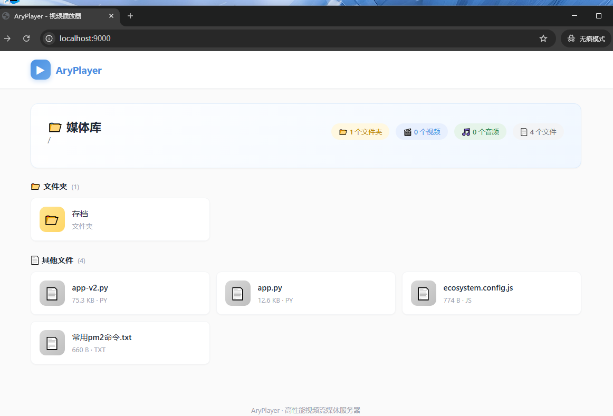
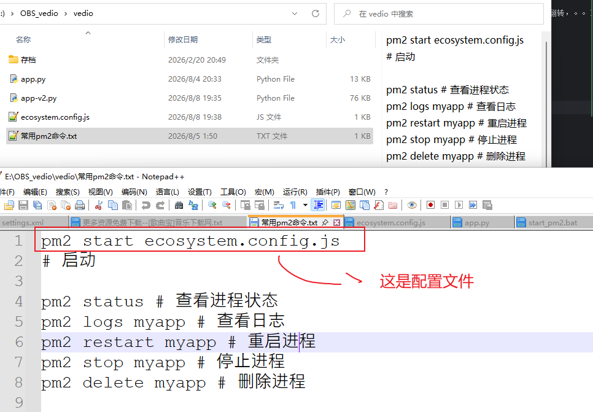

# local_veido_player
本地视频播放服务-python，http，range

# 首页效果



# 具有下面功能
1. 仿照blibli的设计，大体功能都有（播放，暂停，视频翻转，。。）
2. 多线程流程播放


使用方式
一 运行项目
1. 直接运行  python app-v2.py
2. 使用pm2运行项目



根据输出选择网址访问就行（仅限局域网（同一个wifi下））

```agsl
==============================================================
  AryPlayer 高性能视频流服务器已启动
==============================================================
  📁 服务目录: E:\OBS_vedio\vedio
  🌐 本地访问: http://localhost:9000
  📱 手机访问: http://192.168.0.101:9000
  ✨ 内置美观播放器 · 分类浏览 · 连续播放
  ⚙️  Range请求 | 多线程 | 64KB缓冲区优化
  🎯 支持格式: MP4/MKV/AVI/MOV/MP3/FLAC 等
==============================================================
  提示: 点击视频/音频文件即可进入美观播放器页面
  快捷键: 空格(播放/暂停) ←→(±5s) ↑↓(音量)
  按 Ctrl+C 停止服务器
==============================================================
```
